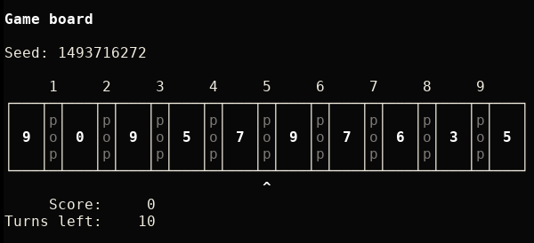

# NumPoppy

Pete Deas' [NumPop](https://petedeas.co.uk/numpop.html) game implemented
in Python 3.

## How to play



### Original instructions

> You have ten turns to gain as many points as you can. Every turn, you
> can pop two adjacent numbers a and b, gaining (a + b) % 10 points. As
> a special bonus, if you would gain no points by doing so, you will gain
> a turn instead of using one up.
>
> When you pop two numbers, they will be replaced at the site of popping
> by the number of points you got, and a random number will be added at
> the right-hand-side of the list.

### Usage

```text
Usage: numpoppy [OPTIONS] [SEED]

positional arguments:
  SEED             initialize random shuffling with SEED

optional arguments:
  -h, --help       show this help message and exit
  -v, --version    show version information and exit
  -c, --copyright  show copying policy and exit
or:
  -s, --simple     use simple box drawing

If a SEED is not given, the random number generator will
be initialized with current time.
```

Pop two cells by pressing the appropriate number. Or use the arrow
left/right keys (or `h`/`l`) and pop with arrow up/down (or `k`/`j`,
or `SPACE`/`Enter`).

Quit prematurely with `Q` or `^C`.

## Requirements

* Python 3
  * Has only been tested on Linux. Unlikely to run on Windows.

----

## Other implementations

* Awk
  * [numpop.awk](https://gist.github.com/mdom/0d1c0c87403d98700c7d4bed08c41a38)
* C
  * [cnumpop](https://tx.god.jp/code/cnumpop/files.html)

:smile:
